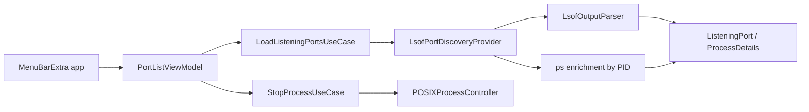

# PortBar

PortBar is a native macOS menu bar app for developers who need to answer one question quickly:

**Which local process is listening on this port, and can I stop it safely?**

PortBar focuses on local TCP listeners instead of trying to be a full process monitor. It prioritizes the processes you are most likely to care about, keeps risky system and background listeners behind an explicit review step, and stays lightweight enough to leave running.

## Features

- Native macOS menu bar app built for macOS 14+
- Shows local listening TCP ports in a fast, focused UI
- Prioritizes user-owned processes by default
- Hides system and background listeners behind an explicit review step
- Expandable process details including PID, owner, bind address, and command metadata when available
- Manual refresh model to keep idle CPU and battery usage low
- Signed and notarized release builds

## Install

### Download From GitHub Releases

1. Open the latest release on GitHub.
2. Download `PortBar-<version>-macOS.zip`.
3. Unzip the archive.
4. Drag `PortBar.app` into `/Applications`.
5. Launch `PortBar.app`.

### Build From Source

Contributor setup:

```bash
git clone https://github.com/RandyVentures/PortBar.git
cd PortBar
./scripts/build_app.sh
./scripts/run_app.sh
```

Requirements:

- macOS 14+
- Xcode
- standard macOS command-line tools such as `lsof` and `ps`

## How It Works

PortBar keeps the default experience intentionally narrow:

- your processes are shown first
- system and background listeners are hidden by default
- non-owned processes are gated behind a review affordance
- stop actions always require confirmation
- process details can be expanded when you need more context

This makes PortBar useful for common local development tasks without turning it into a noisy Activity Monitor clone.

## Architecture

PortBar follows a small clean-architecture split so the core behavior stays testable and the menu bar UI stays thin.



Layers:

- `PortBarCore/Domain`: entities and value types
- `PortBarCore/Application`: use cases and protocols
- `PortBarCore/Infrastructure`: `lsof`, `ps`, and POSIX process control
- `PortBar/Presentation`: SwiftUI views and view model
- `PortBar/App`: menu bar app entry point

For a deeper walkthrough, see [`docs/ARCHITECTURE.md`](docs/ARCHITECTURE.md).

## Development

Useful commands:

```bash
open PortBar.xcodeproj
swift test
./scripts/build_app.sh
./scripts/run_app.sh
```

Release packaging and notarization are documented in [`docs/RELEASE.md`](docs/RELEASE.md).

## Testing

Current automated coverage focuses on core behavior:

- parsing `lsof` output
- deduplicating and sorting listeners
- stop escalation from terminate to force kill
- failure propagation for discovery and stop flows

For manual verification, use [`docs/QA_CHECKLIST.md`](docs/QA_CHECKLIST.md).

## Roadmap

Current focus areas:

- improve screenshots and public-facing polish
- add more UI and view-model coverage
- continue tightening process identification and review UX
- evaluate Homebrew Cask after the release flow settles

## License

[MIT](LICENSE)
