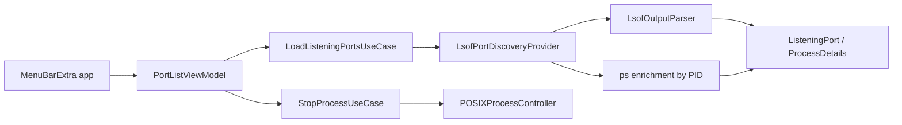

# PortBar

PortBar is a native macOS menu bar app for developers who need to answer one question quickly:

Which local process is listening on this port, and can I stop it safely?

Instead of acting like a miniature Activity Monitor, PortBar stays focused on local TCP listeners, surfaces the processes you are most likely to care about, and keeps higher-risk system and background listeners behind an explicit review step.

## Why It Exists

Local development machines accumulate listeners:

- `node`, `vite`, Rails, Python, Go, and Java dev servers
- databases and caches
- background agents you forgot were still running

`lsof` is powerful, but it is not the fastest way to make a quick decision from the menu bar. PortBar packages that workflow into a small, low-idle-cost utility.

## Current UX

PortBar is intentionally narrow:

- user-owned listeners are shown first
- system and background listeners are hidden by default
- non-owned processes are gated behind a review affordance
- refresh is manual to avoid idle CPU and battery drain
- stop actions always require confirmation
- each row can expand to show PID, owner, bind address, and process details

## Screenshots

Add screenshots once the visual polish is finalized:

- menu bar icon and popover
- safe-to-stop section
- review-required disclosure
- stop confirmation flow
- expanded process details

## Quick Start

### Requirements

- macOS 14+
- Xcode
- standard macOS command-line tools such as `lsof` and `ps`

### Open in Xcode

```bash
open PortBar.xcodeproj
```

Run the `PortBar` scheme on `My Mac`.

### Build a Local App Bundle

```bash
./scripts/build_app.sh
```

This writes the app bundle to:

```text
build/DerivedData/Build/Products/Debug/PortBar.app
```

### Run from the Command Line

```bash
./scripts/run_app.sh
```

### Run Tests

```bash
swift test
```

## Architecture

PortBar follows a small clean-architecture split so the core behavior stays testable and the menu bar UI stays thin.



Layers:

- `PortBarCore/Domain`: entities and value types
- `PortBarCore/Application`: use cases and protocols
- `PortBarCore/Infrastructure`: `lsof`, `ps`, and POSIX process control
- `PortBar/Presentation`: SwiftUI views and view model
- `PortBar/App`: menu bar app entry point

For the full architecture walkthrough and sequence diagrams, see [`docs/ARCHITECTURE.md`](docs/ARCHITECTURE.md).

## Engineering Direction

The codebase is optimized for:

- clean architecture
- testable core logic
- TDD for parser and use-case behavior
- BDD-style test naming and QA language
- low idle memory, CPU, and battery usage

The current implementation deliberately avoids:

- background polling
- passive watchers
- retained history
- turning the app into a full process monitor

## Testing and QA

Current test coverage focuses on the core behaviors that carry the most risk:

- parsing `lsof` output
- deduplicating and sorting listeners
- stop escalation from terminate to force kill
- failure propagation for discovery and stop flows

Manual QA is still important for:

- menu bar launch behavior
- process visibility and grouping
- confirmation flow
- macOS permission edge cases

Use [`docs/QA_CHECKLIST.md`](docs/QA_CHECKLIST.md) for repeatable manual verification.

## Repo Layout

```text
Sources/
  PortBar/
    App/
    Presentation/
  PortBarCore/
    Application/
    Domain/
    Infrastructure/
Tests/
  PortBarCoreTests/
docs/
  ARCHITECTURE.md
  QA_CHECKLIST.md
```

## Status

PortBar is already usable for local development workflows and is being tightened for broader public release.

Current strengths:

- real menu bar app target
- safer default UX than raw process lists
- repo-local build output
- clean core/application split
- fast SwiftPM test loop

Current follow-up areas:

- better screenshots and release assets
- more tests around UI/view-model behavior
- broader runtime QA on real macOS machines
- clearer identification for opaque system daemons

For the implementation roadmap, see [`PLAN.md`](PLAN.md).
