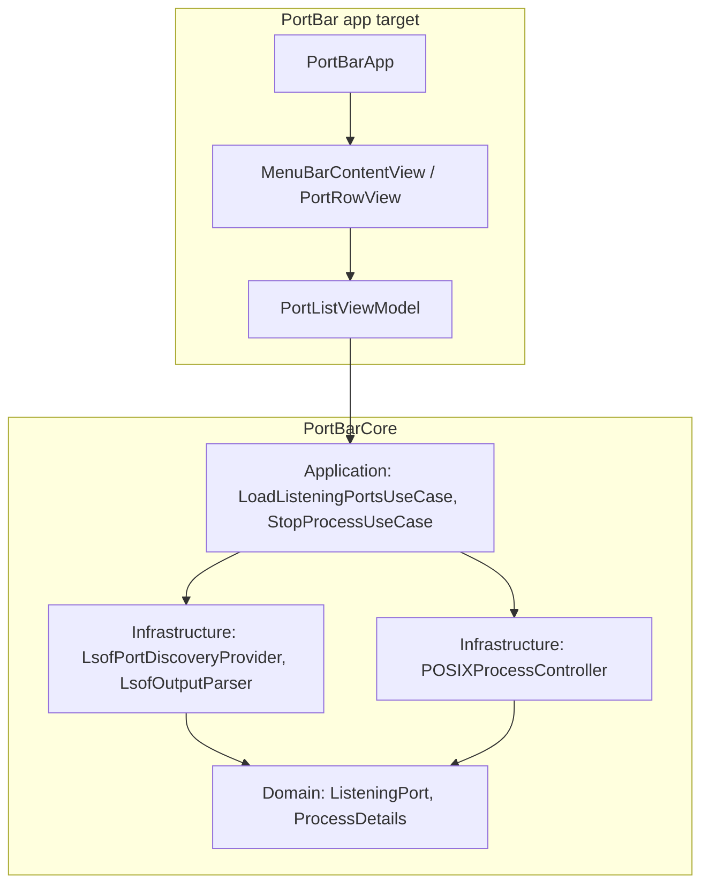
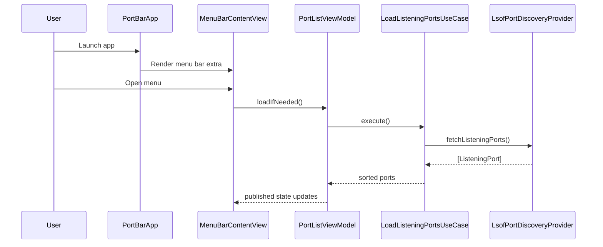
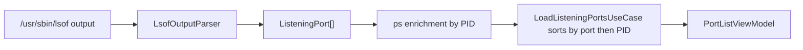
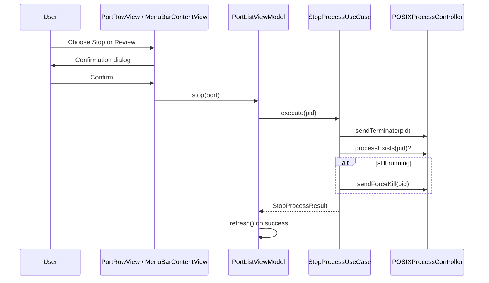

# PortBar Architecture

PortBar is a macOS menu bar utility for discovering listening TCP ports and stopping the process that owns a port when that is safe to do so. The codebase is intentionally split so the core logic stays testable without SwiftUI or AppKit.

## Goals

- Keep the app lightweight and manual-refresh only to avoid idle CPU and battery drain.
- Keep business rules in `PortBarCore`, not in SwiftUI views.
- Make port discovery and process stopping easy to unit test.
- Keep the menu bar UI thin and replaceable.

## Layering

PortBar follows a clean-architecture style split:

- `PortBarCore/Domain` holds the app entities and value types.
- `PortBarCore/Application` holds use cases and protocols.
- `PortBarCore/Infrastructure` holds shelling out to system tools and parsing their output.
- `PortBar/Presentation` holds SwiftUI views and the `ObservableObject` view model.
- `PortBar/App` holds the `@main` app entry and menu bar scene wiring.

## App Flow

The app uses a `MenuBarExtra` scene and stays in the menu bar instead of opening a normal window.

1. `PortBarApp` creates one shared `PortListViewModel`.
2. `MenuBarContentView` calls `loadIfNeeded()` when the menu opens.
3. The view model triggers `LoadListeningPortsUseCase`.
4. The menu shows owned ports first and keeps review-required listeners behind an explicit disclosure.
5. Refresh is manual, so the app does no periodic polling in the background.

## Port Discovery

Discovery is centered around `lsof` because it already knows which processes are listening on TCP ports.

1. `LsofPortDiscoveryProvider` runs `/usr/sbin/lsof -n -P -iTCP -sTCP:LISTEN`.
2. `LsofOutputParser` converts the raw text into `ListeningPort` values.
3. The provider enriches each PID with process metadata from `ps`.
4. The result is sorted by `LoadListeningPortsUseCase` before it reaches the UI.

### Why the extra `ps` lookup exists

`lsof` gives the listening port, PID, and owner. PortBar uses `ps` as a cheap second pass to capture:

- parent PID
- executable path
- full command line

That extra context makes it easier to tell whether a process is a dev server, a background agent, or something system-owned that should be reviewed before stopping.

## Stop Flow

Stopping a process is deliberately conservative.

1. The user clicks `Stop` on a user-owned process or `Review` on a non-owned process.
2. The UI opens a confirmation dialog.
3. `PortListViewModel` calls `StopProcessUseCase`.
4. The use case sends `SIGTERM`, waits briefly, and checks whether the process exited.
5. If needed, it escalates to `SIGKILL`.
6. The view model refreshes the list after a successful stop.

## Test Boundaries

The architecture is built to support fast unit tests.

- Parser tests cover raw `lsof` output and malformed rows.
- Use case tests cover sorting and stop escalation behavior.
- View model tests can mock the use cases without touching the shell.
- SwiftUI views stay thin and are exercised mainly through behavior rather than shelling out.

## Operational Notes

- The app is menu-bar only via `LSUIElement`.
- No background polling is used.
- The default UI shows owned processes first and keeps review-required listeners behind a disclosure.
- The stop path always confirms before acting.

